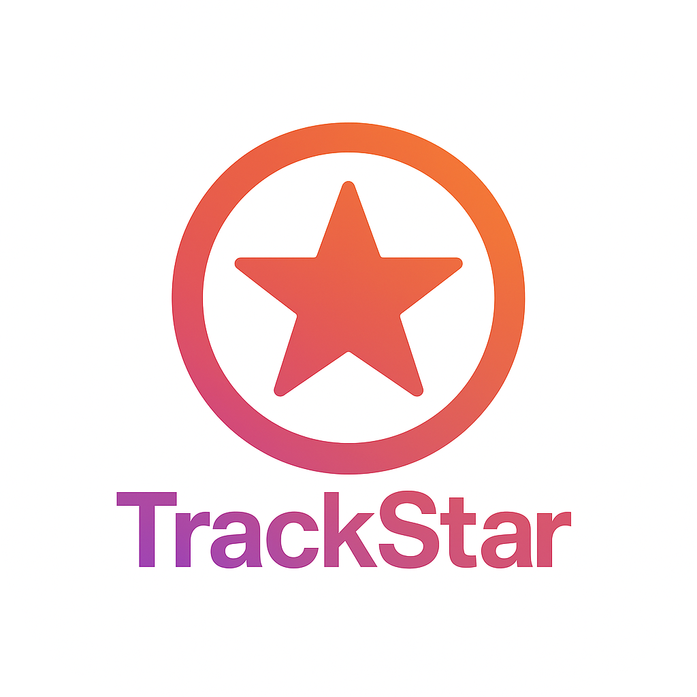
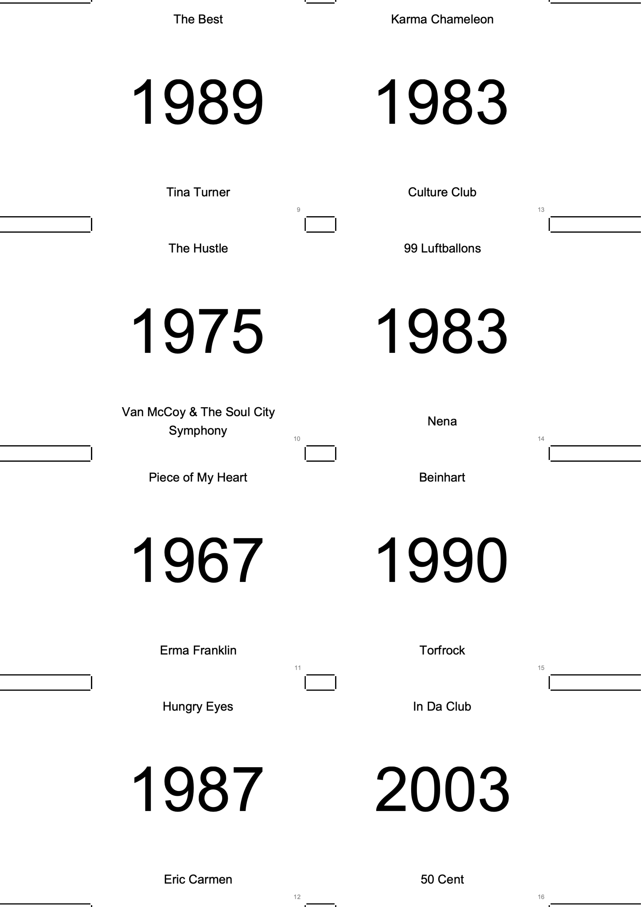
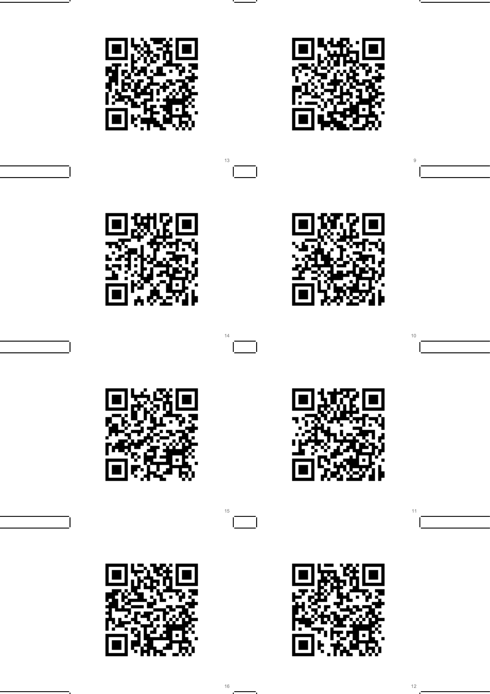

<p align="center">
  
</p>

<div align="center">
    <h1>TrackStar ✨</h1>
  
  **An open-source game inspired by Hitster, where players guess the release year of songs to build a chronological timeline. 🎶**

  
   [](https://github.com/BennoCrafter/TrackStar)
   [](https://github.com/BennoCrafter/TrackStar)
   [](https://github.com/BennoCrafter/TrackStar/issues)
   [](https://github.com/BennoCrafter/TrackStar/commits/main)
   [](https://discord.gg/JNu7qXGpzV)
</div>


## Preview ⭐️
| Front cards | Back cards | Gameplay |
|------------|------------|----------|
|  |  |  |

## Key Features 🚀

*   **Gameplay:** Guess the release year of songs and create a chronological timeline.
*   **Open-Source:**  Contribute to the project and help expand its features.
*   **Custom Datasets:** Create your own song datasets using the provided `generate.py` backend script.
*   **Apple Music Integration:** Play the songs using Apple Music.
*   **Hitster cards support:** Choose between your own printed cards or use the original Hitster card set.

## Creating Custom Datasets

TrackStar allows you to use custom song datasets. A Python script, `generate.py` in the `backend` directory, is provided to help you generate these datasets.

If you've created a custom dataset that you think would be valuable for other players, consider contributing it to the official repository:

- Create a pull request with:
   - A clear description of your dataset (genre, time period, theme etc.)
   - Any special notes about the dataset


## Installation 💻

### Prerequisites

*   Xcode (latest version recommended)
*   Swift (6.0 or higher)
*   A macOS environment for development

### Steps

1.  Clone the repository:

    ```bash
    git clone https://github.com/BennoCrafter/TrackStar.git
    cd TrackStar
    ```

2.  Open the project in Xcode:

    ```bash
    open TrackStar.xcodeproj
    ```

3.  Build and run the project on your desired device.

## Contributing 🤝

This project is open to contributions.

## License 📝

This project is licensed under the Mozilla Public License 2.0 - see the [LICENSE](LICENSE) file for details.
